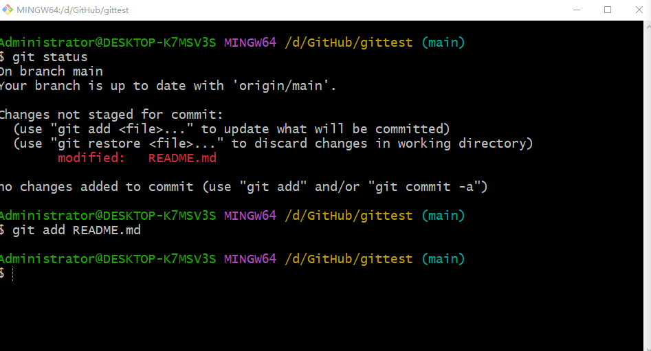

# gittest

这个项目主要就是用来测试的。

一直不会使用git，所以看视频来学习一下。

-------

git init	初始化git仓库

git clone https://github.com/nieyuli98/gittest.git	克隆、下载远程仓库

git config user.name xxxx	设置用户名

git config user.email	xxx@xxx	设置邮箱  

git status	 查看暂存区状态

git add 文件名	把文件添加到暂存区

git add *	git支持通配符

git commit -m 描述	

示例：git commit -m 提交了文件