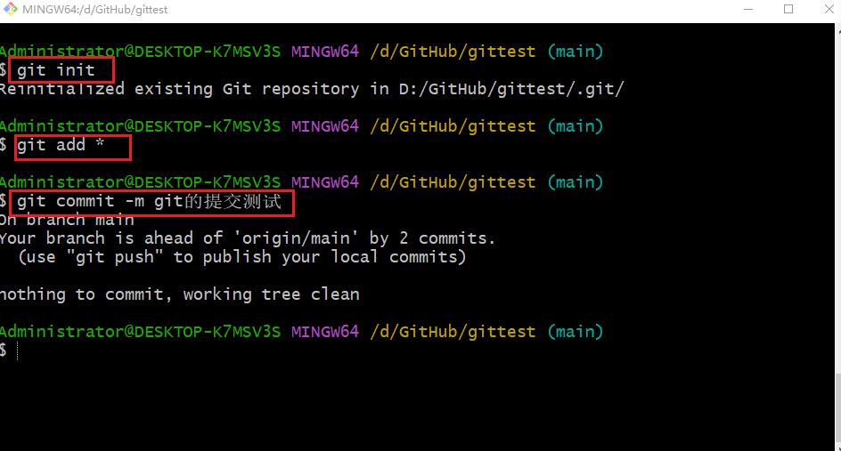
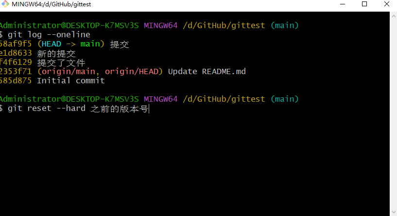
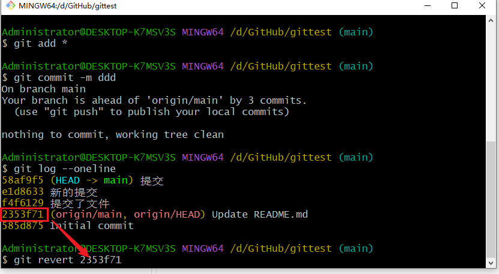

# gittest

这个项目主要就是用来测试的。

一直不会使用git，所以看视频来学习一下。

-------

git init	初始化git仓库

git clone https://github.com/nieyuli98/gittest.git	克隆、下载远程仓库

git config user.name xxxx	设置用户名

git config user.email	xxx@xxx	设置邮箱  

git status	 查看暂存区状态

git add 文件名	把文件添加到暂存区

git add *	git支持通配符

git commit -m 描述	

示例：git commit -m 提交了文件

--------

总结：

常用的就是下面几步：

如果项目文件已经commit过，如果我们误删除了文件，可以使用git restore恢复。

示例：

git restore 文件名

如果我们删除了文件以后，又commit了，这样通过git restore是无法恢复的。

这个时候我们可以使用git log --oneline命令查看之前的版本号，然后再使用git reset --hard 之前的版本号来恢复。

或者，通过git revert 自己想要的版本号，来恢复

最后，使用git push推送的原创仓库。

