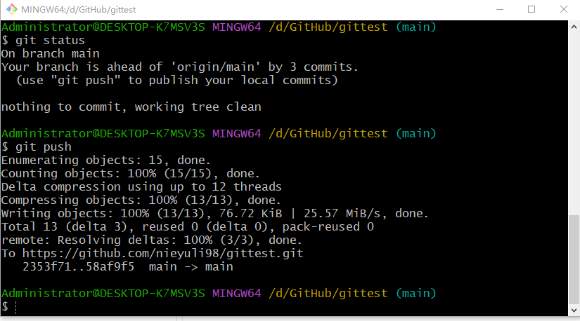

# gittest

这个项目主要就是用来测试的。

一直不会使用git，所以看视频来学习一下。

-------

Git 是一款分布式版本控制系统，用于跟踪代码的变化并协同开发。以下是一些 Git 的常用命令：

1. **初始化一个仓库：**

   ```
   csharpCopy code
   git init
   ```

2. **克隆仓库：**

   ```
   bashCopy code
   git clone <仓库URL>
   ```

3. **添加文件到暂存区：**

   ```
   csharpCopy code
   git add <文件名>
   ```

4. **提交变更到本地仓库：**

   ```
   sqlCopy code
   git commit -m "提交说明"
   ```

5. **查看仓库状态：**

   ```
   luaCopy code
   git status
   ```

6. **查看提交历史：**

   ```
   bashCopy code
   git log
   ```

7. **创建分支：**

   ```
   phpCopy code
   git branch <分支名>
   ```

8. **切换分支：**

   ```
   phpCopy code
   git checkout <分支名>
   ```

9. **创建并切换到新分支：**

   ```
   cssCopy code
   git checkout -b <新分支名>
   ```

10. **合并分支：**

    ```
    phpCopy code
    git merge <要合并的分支名>
    ```

11. **拉取远程仓库的变更：**

    ```
    Copy code
    git pull
    ```

12. **推送变更到远程仓库：**

    ```
    perlCopy code
    git push
    ```

13. **查看远程仓库信息：**

    ```
    Copy code
    git remote -v
    ```

14. **添加远程仓库：**

    ```
    phpCopy code
    git remote add <远程仓库名> <仓库URL>
    ```

15. **从远程仓库拉取指定分支：**

    ```
    phpCopy code
    git fetch <远程仓库名> <分支名>
    ```

16. **撤销工作区的修改：**

    ```
    phpCopy code
    git restore <文件名>
    ```

17. **撤销暂存区的修改：**

    ```
    cssCopy code
    git restore --staged <文件名>
    ```

18. **重命名文件：**

    ```
    phpCopy code
    git mv <旧文件名> <新文件名>
    ```

这只是 Git 命令的一小部分，更多命令和选项可通过 `git --help` 查看帮助文档。

---------------------------------


git init	初始化git仓库

git clone https://github.com/nieyuli98/gittest.git	克隆、下载远程仓库

git config user.name xxxx	设置用户名

git config user.email	xxx@xxx	设置邮箱  

git status	 查看暂存区状态

git add 文件名	把文件添加到暂存区


git add *	git支持通配符

git commit -m 描述	

示例：git commit -m 提交了文件

--------

总结：

常用的就是下面几步：


如果项目文件已经commit过，如果我们误删除了文件，可以使用git restore恢复。

示例：

git restore 文件名

如果我们删除了文件以后，又commit了，这样通过git restore是无法恢复的。

这个时候我们可以使用git log --oneline命令查看之前的版本号，然后再使用git reset --hard 之前的版本号来恢复。


或者，通过git revert 自己想要的版本号，来恢复


最后，使用git push推送的原创仓库。




